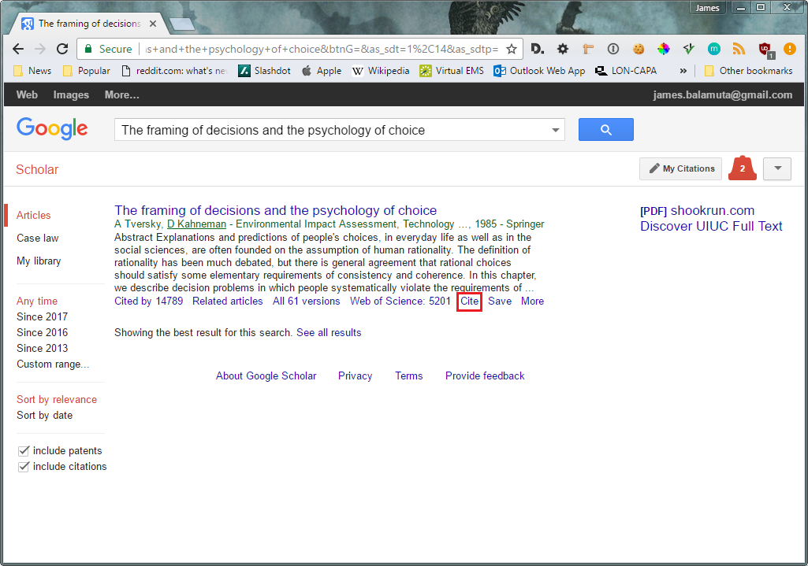

# Introduction

Within `rmarkdown` [@CRAN:rmarkdown], we are able to use [BibLaTeX](https://en.wikibooks.org/wiki/LaTeX/Bibliography_Management)
to automatically generate bibliographies. Bibliographies store the references
to different resources that were consulted when creating the report. Previously,
these bibliographies may have been created with the assistance of web sites
like [mendeley](https://www.mendeley.com/?interaction_required=true), [refworks](https://www.refworks.com/),
or [zotero](https://www.zotero.org/).

The goal of this document is to expand upon the web-based citation
documentation for `rmarkdown` by @RStudio:rmarkdown:citations.

# Bibliographies

## BibLaTeX

[BibLaTeX](https://en.wikibooks.org/wiki/LaTeX/Bibliography_Management) is a 
way to structure citations used within a paper. You can obtain citation entries
for scholarly works from [Google Scholar](https://scholar.google.com/) using
the "BibTeX" entry. In the subsequent sections, we'll work through an example
where we obtain citation information for a paper and include it within an
`rmarkdown` report.

\newpage

## Google Scholar Search Portal

Just like with regular ol' Google, type into the search bar either the
full paper names or just the key terms that you are interested in.

```{r google_scholar, echo = FALSE, eval = TRUE, fig.align='center'}
knitr::include_graphics("img/scholar/google_scholar.PNG")
```

## Obtaining a citation from Google Scholar

Once you found the paper you were looking for, press the `Cite` button.

```{r google_scholar_search_result, echo = FALSE, eval = TRUE, fig.align='center'}

```

## Navigating Citation Options

From the citation menu, there are many different export options. In our case, we'll opt for the `BibTeX` option.

```{r google_scholar_cite_options, echo = FALSE, eval = TRUE, fig.align='center'}
knitr::include_graphics("img/scholar/google_scholar_cite_options.PNG")
```

## Copying the BibLaTeX Citation.

From here, use either `CNTRL` + `C` (Windows/Linux) or `CMD` + `C` (macOS) to
copy the citation.

```{r google_scholar_BibLaTeX, echo = FALSE, eval = TRUE, fig.align='center'}
knitr::include_graphics("img/scholar/google_scholar_bibtex.PNG")
```

\newpage

## Structuring a `.bib` file

Bibliography information is stored in a `.bib` file, which is just a regular
text file.

Here is what the `bibliography.bib` file would look like with the citation
obtained in the previous example in addition to another citation that already 
existed.

```
@incollection{tversky1985framing,
  title={The framing of decisions and the psychology of choice},
  author={Tversky, Amos and Kahneman, Daniel},
  booktitle={Environmental Impact Assessment, Technology Assessment,
             and Risk Analysis},
  pages={107--129},
  year={1985},
  publisher={Springer}
}
@book{ho1987,
  title={Rational choice: Contrast between economics and psychology.},
  author={Hogarth, Robin M and Reder, Melvin W},
  year={1987},
  publisher={University of Chicago Press}
}
```

# RMarkdown YAML for including a bibliography

The header information for the RMarkdown file gains 
one additional entry that corresponds to the `.bib` bibliography 
file generated previous.

```markdown
---
title: "Example Biblography heading"
output: html_document
bibliography: bibliography.bib
---
```

# Citing Papers, Software, and Websites

## Citing a Paper

Inside of the document, you can use: 

- `[@tversky1985framing]` to obtain both the author names and a year in parentheses.
    - "Choice is important **(Tversky and Kahneman 1985)**."
- `[-@tversky1985framing]` provides only a year in parentheses
    - Tversky and Kahneman says, "Choice is important **(1985)**."
- `[see @tversky1985framing, pg. 15]` provides context for the citation.
    - "Choice is important" **(see Tversky and Kahneman 1981, pg. 15)**.
- `@tversky1985framing` provides the author names with only the year in parentheses.
    - From **Tversky and Kahneman (1985)**, we know that "choice is important."

**Example:** Everyone should read the @tversky1985framing paper.

## Citing the _R_ programming language

When you first open _R_, you are prompted in the startup text
with a paragraph on how to cite _R_ and its package:

> R is a collaborative project with many contributors.
> Type 'contributors()' for more information and
> 'citation()' on how to cite R or R packages in publications.

Typing `citation()` gives:

```{r, echo = FALSE}
citation()
```

We're interested in the **BibLaTeX** entry. That is, we want to
copy into our `.bib` file these lines:

```latex
@Manual{,
  title = {R: A Language and Environment for Statistical Computing},
  author = {{R Core Team}},
  organization = {R Foundation for Statistical Computing},
  address = {Vienna, Austria},
  year = {2018},
  url = {https://www.R-project.org/},
}
```

Note, we'll need to add a "name" right after the `@Manual{` in order to refer to this entry. Thus, a complete entry would be given by:

```latex
@Manual{R:2018, # <-- Add name to reference (Remove the # and everything to the right)
  title = {R: A Language and Environment for Statistical Computing},
  author = {{R Core Team}},
  organization = {R Foundation for Statistical Computing},
  address = {Vienna, Austria},
  year = {2018},
  url = {https://www.R-project.org/},
}
```

From there, we can use the previous citing syntax of `@R:2018` to reference the entry. Note that _R_ is a powerful language produced by @R:2018 that we used to conduct our analysis. 

## Citing _R_ Packages

We can also generate citations for _R_ packages that are **installed**
by using `citation("pkgname")`. For example, the citation for `ggplot2` would 
be given by:

```{r}
citation("ggplot2")
```

We'll again copy the **BibLaTeX** code and add a name to the citation entry:

```latex
@Book{ggplot2:Wickham:2016, # <- Reference Name (Delete # and everything to the right)
  author = {Hadley Wickham},
  title = {ggplot2: Elegant Graphics for Data Analysis},
  publisher = {Springer-Verlag New York},
  year = {2016},
  isbn = {978-3-319-24277-4},
  url = {http://ggplot2.org},
}
```

And the rest of the story is the same regarding accessing the citation through
a reference. For example, we have:

- `@ggplot2:Wickham:2016` generates `Wickham (2016)`
- `[@ggplot2:Wickham:2016]` generates `(Wickham 2016)`
- `[-@ggplot2:Wickham:2016]` generates `(2016)`


@ggplot2:Wickham:2016 provides the ability to use the grammar of graphics 
to generate visualizations for data.

## Citing Websites

As a majority of content is on the web, there are different ways to cite websites. 
The following template should work for cases where you need to cite a news article,
blog post, web API documentation, and so on. For a beginning entry, consider
the [STAT 385](http://stat385.stat.illinois.edu) website.

```latex
@misc{STAT385:website:2018,
      title  = {{STAT 385 FA 2018 Course Website}},
      author = {{James Balamuta}},
      year   = {2017},
      note   = {\url{http://stat385.stat.illinois.edu}, Last accessed November 13, 2018)}
}
```

Another example would be the RMarkdown documentation for bibliographies.

```latex
@misc{RStudio:rmarkdown:citations,
      title  = {{Bibliographies and Citations}},
      author = {{RStudio}},
      year   = {2014},
      note   = {\url{https://rmarkdown.rstudio.com/authoring_bibliographies_and_citations.html}, Last accessed November 13, 2018)}
}
```

# Adding References to a Document

By default, the bibliography will be added at the end of the document.
It is customary to provide a header to the documents reference section by
using a single-level heading with the name "References", e.g.

```md
# References
```

# References
